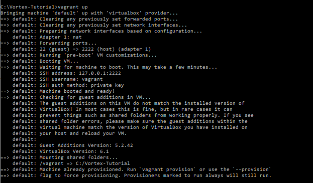

## Vortex Virtual Machine Instructions
For this tutorial, we provide access to a remote server with the tools as well as a virtual machine
image that contains the prebuilt version of the tools as well as the Vortex git repo. This VM is
built using Vagrant with a VirtualBox Provider, which means that it should be easy to run on most platforms.

We also provide the base Vagrantfile we use, although we note that setup may require some additional steps.
See "Building Vortex from Scratch" for more details on setting up a new VM and/or a base installation of the
tools.


## VM Usage Instructions

First you will need to install [Vagrant](https://www.vagrantup.com) and [VirtualBox](). We have tested
on Linux and Windows 10 with Vagrant 2.2.18 and VirtualBox 6.1.26.

#### Important note for Apple Macbook M1 users
VirtualBox is not supported on M1 laptops and systems due to the switch from an x86 to aarch64 processor.
You can technically use a Vagrantfile with Docker, but we haven't tested this and can't confirm that it
works as expected. Success would depend on whether all the required packages can be installed for aarch64 
in the underlying Docker container. [Here](https://app.vagrantup.com/jeffnoxon/boxes/ubuntu-20.04-arm64) 
is one possible Vagrant setup that could be investigated if you are interested.

For this tutorial, we recommend using the remote server rather than the local VM if you only have local
access to an M1 device.

### Vagrant set up and initialization

#### Windows Setup

1) Download the Vortex Vagrant Box image and the updated Vagrantfile to your computer
    * If you need to increase/decrease the number of cores used by the VM, you can make this change in the Vagrantfile.

2) Import the Vagrant Box image using the command-line

```
vagrant box add vortex-micro vortex-ubuntu18
vagrant init vortex-micro
vagrant up
```
Once it completes booting and returns back to the command prompt you can ssh into the VM.



```
vagrant ssh
```

3) When you are finished working with the VM, make sure to exit your session and run `vagrant halt` to power
the VM down. It is preferred to halt the VM with Vagrant than using the VirtualBox manager to power down the VM 
due to the additional setup steps that Vagrant performs.

Note that you can see and log into the VM using the VirtualBox Manager GUI. Just remember to start/stop the image with
Vagrant, if possible.


